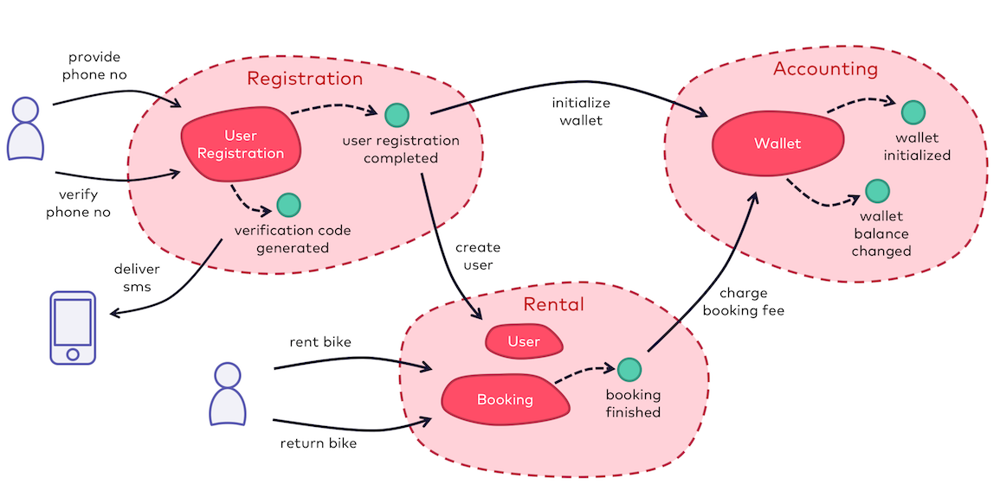

# DDD-To-The-Code Workshop: Sample Code

Sample project for "DDD to the Code" workshop.

## Disclaimer

This sample project is for educational purposes only. It does not contain production-ready code. Specifically, the 
following aspects are not considered real-world like:
 
- shared code in 'ddd-to-the-code-workshop-support'
- in-memory database for persistence of aggregates
- prototypical domain event infrastructure implementation (non-durable subscriptions, no dead letter handling, ...)
- low test coverage in accounting and rental bounded contexts
- no handling of dependencies between domain events (e.g. in case booking is ended and should be billed
based on the 'booking completed' domain event before the wallet has been initialized based on the 'user registration 
completed' domain event - currently, handling the 'booking completed' domain event would fail, the domain event would
be redelivered and eventually moved to dead letter queue)

... and a lot more

## Overview

### Use Cases
- register new user
- initialize wallet for user with welcome amount
- book and return bike
- bill booking fee on wallet

## Demo

Use the following script to walk through the implemented use cases:

### Preparation

*Note*: due to compatibility issues with AspectJ and Java 11, this project has to be compiled and executed using Java 8.

- build project:  
  `./mvnw clean package`
- start registration bounded context:   
  `java -jar ddd-to-the-code-workshop-registration/target/ddd-to-the-code-workshop-registration-0.0.1-SNAPSHOT.jar`
- start rental bounded context:  
  `java -jar ddd-to-the-code-workshop-rental/target/ddd-to-the-code-workshop-rental-0.0.1-SNAPSHOT.jar`
- start accounting bounded context:  
  `java -jar ddd-to-the-code-workshop-accounting/target/ddd-to-the-code-workshop-accounting-0.0.1-SNAPSHOT.jar`

### Initial State
- list of existing bikes (<http://localhost:8083/rental/bikes>): all bikes available 
- list of wallets (<http://localhost:8082/accounting/wallets>): no wallets existing
- list of bookings (<http://localhost:8083/rental/bookings>): no bookings existing

### Register New User
- start user registration (<http://localhost:8081/user-registration/>)
- enter user handle (e.g. "peter")
- click "Next >" button
- read verification code from console of registration bounded context (6 digits code)
- enter verification code
- click "Next >" button
- enter first and last name (e.g. "Peter" and "Meier")
- click "Complete" button
- check for new wallet (<http://localhost:8082/accounting/wallets>) with initial amount

### Book Bike
- choose bike (<http://localhost:8083/rental/bikes>)
- enter user handle (e.g. "peter")
- click "Book" button
- check list of booking (<http://localhost:8083/rental/bookings>): new booking (still running)
- check list of bikes (<http://localhost:8083/rental/bikes>): chosen bike not available for booking
- wait some time

### Return Bike
- list bookings (<http://localhost:8083/rental/bookings>)
- click "Return Bike" button
- check list of booking (<http://localhost:8083/rental/bookings>): booking is ended
- check list of bikes (<http://localhost:8083/rental/bikes>): previously chosen bike again available
- check list of wallets (<http://localhost:8082/accounting/wallets>): booking fee deducted from wallet
